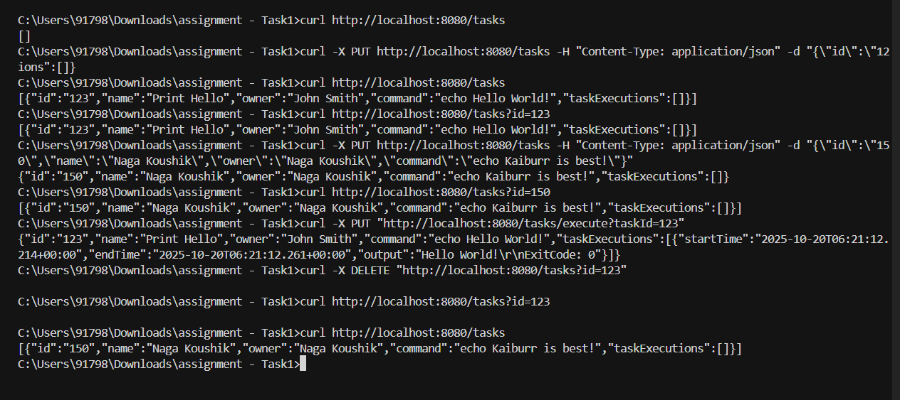
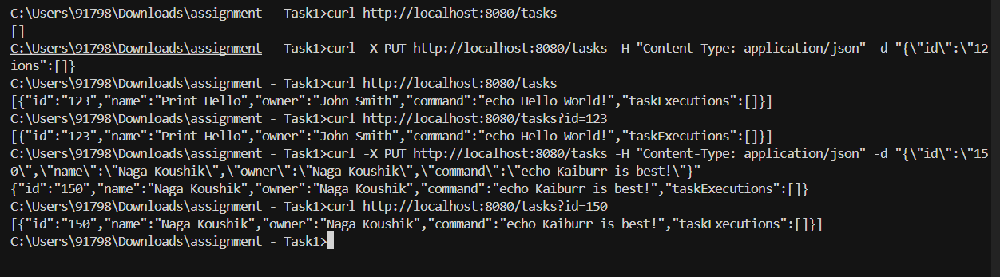
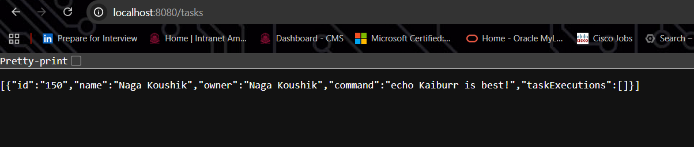
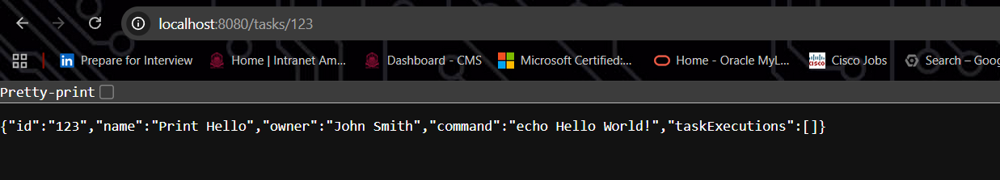
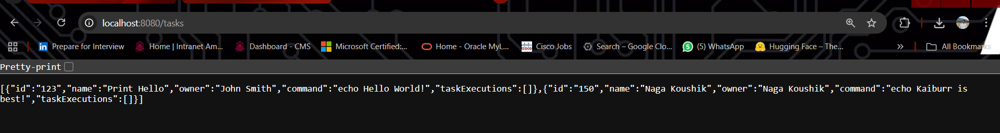
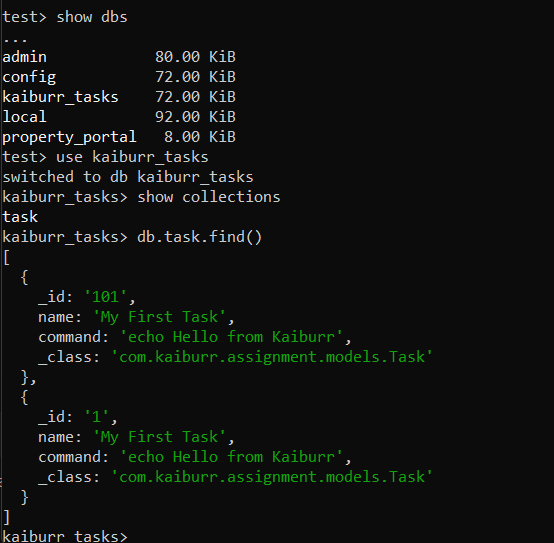

# 🧩 Kaiburr Assessment 2025 — Task 1  
## Java Backend and REST API Example

### 📘 Overview
This project implements a **Java-based RESTful API** for managing and executing “Task” objects that represent shell commands.  
Each task includes details such as `id`, `name`, `owner`, `command`, and a list of past executions stored in **MongoDB**.

The application allows users to:
- Create new tasks  
- Retrieve all tasks or by ID/name  
- Delete existing tasks  
- Execute shell commands via a REST endpoint (with output stored in `TaskExecutions`)

---

### 🧠 Tech Stack
| Component | Technology Used |
|------------|-----------------|
| Backend Framework | Spring Boot |
| Database | MongoDB |
| Build Tool | Maven |
| REST Client for Testing | Postman / cURL |
| Language | Java 17+ |

---

### 📂 Project Structure

```
assignment_task1/
│
├── src/
│ ├── main/
│ │ ├── java/com/kaiburr/taskapi/
│ │ │ ├── controller/TaskController.java
│ │ │ ├── model/Task.java
│ │ │ ├── model/TaskExecution.java
│ │ │ ├── repository/TaskRepository.java
│ │ │ ├── service/TaskService.java
│ │ │ └── TaskApiApplication.java
│ │ └── resources/
│ │ ├── application.properties
│ │ └── ...
│ └── test/
│
├── pom.xml
└── README.md
```
---

### ⚙️ Setup Instructions

#### **Clone the Repository**
```bash
git clone https://github.com/<your-username>/kaiburr-task1-restapi.git
```
#### **Configure MongoDB**

Make sure MongoDB is running locally or in the cloud.

Edit src/main/resources/application.properties
```
spring.data.mongodb.uri=mongodb://localhost:27017/kaiburrdb
server.port=8080
```
#### Build and Run
```
mvn clean install
mvn spring-boot:run
```

| Method   | Endpoint                      | Description                      |
| -------- | ----------------------------- | -------------------------------- |
| `GET`    | `/tasks`                      | Get all tasks                    |
| `GET`    | `/tasks/{id}`                 | Get task by ID                   |
| `GET`    | `/tasks/find?name={taskName}` | Search tasks by name             |
| `PUT`    | `/tasks`                      | Create or update a task          |
| `DELETE` | `/tasks/{id}`                 | Delete a task                    |
| `PUT`    | `/tasks/{id}/execute`         | Execute the task’s shell command |

## Testing the Endpoints (via Postman or cURL)
```
curl -X GET http://localhost:8080/tasks

curl -X PUT http://localhost:8080/tasks \
     -H "Content-Type: application/json" \
     -d '{"id":"123","name":"Print Hello","owner":"Naga Koushik","command":"echo Hello Kaiburr!"}'

curl -X PUT http://localhost:8080/tasks/123/execute

curl -X DELETE http://localhost:8080/tasks/123

```

## Screenshorts of Output

  | All Tasks retrieved via GET |
|  | Task created successfully |
|  | Command executed successfully |
|  | MongoDB data verification |
|  | Spring Boot server run log |
| 


